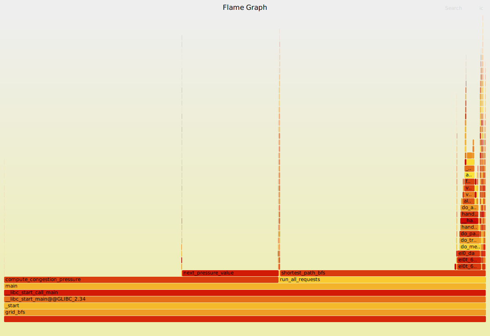
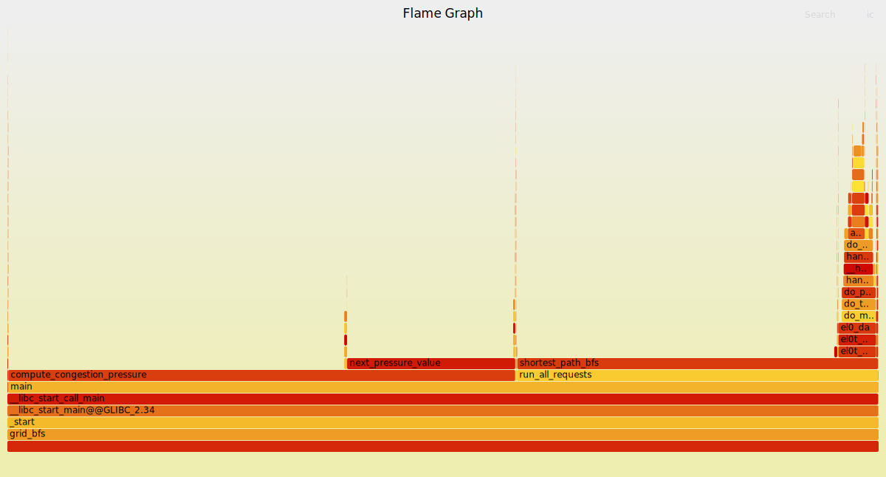

# Intro Profiling Lab Report

## 1. Optimizations Made

- **Memory leak fix + memory reduction (shortest_path_bfs, `grid_bfs.cpp:211-268`):** removed the separate `visited` array and used a single `distance` vector initialized to `-1` as the visited marker. This eliminates two raw `new[]` allocations, reduces per-request memory, and fixes the leak.
- **Row-major traversal in `compute_congestion_pressure` (`grid_bfs.cpp:395-415`):** swapped the inner loops to iterate row-major over the row-major `current/next` arrays and reused a row offset to reduce cache misses.
- **Simplify arithmetic in `next_pressure_value` (`grid_bfs.cpp:358-361`):** replace divides with shifts and reduce the pulse expression modulo 16 to cut multiplies.
- **Simplify branch structure in `next_pressure_value` (`grid_bfs.cpp:363-366`):** flip the branch so the common path falls through, reducing branch cost in the hotspot.
- **Reuse BFS buffers across requests (`grid_bfs.cpp:277-296`):** allocate `distance` and `frontier` once in `run_all_requests` and reuse them inside `shortest_path_bfs`.
- **Flatten BFS data access (`grid_bfs.cpp:191-268, 277-296`):** build a contiguous `open_cells` grid, use 1D indices in the frontier, and precompute neighbor offsets to reduce pointer-chasing and per-neighbor math.
- **Shrink heatmap/congestion buffers to `uint16_t` (`grid_bfs.cpp:212-421, 493-539`):** reduce storage width for `heatmap`, congestion `current/next/source`, and their summaries while keeping distance as `int` for correctness.
- **Enable vectorization in the congestion loop (`grid_bfs.cpp:390-414`, `Makefile:5-7`):** add `__restrict__` pointers plus vectorization pragmas, and compile perf/optimized builds with `-O3 -march=native` to let the compiler auto-vectorize the tight inner loop.
- Used **-O3** flag for compilation instead of **O2**

## 2. Methodology Walkthrough

We first checked for memory leaks, then profiled to identify the primary hotspots. Hotspot profiling (perf/gprof) pointed to `compute_congestion_pressure`, `shortest_path_bfs`, and `next_pressure_value`, so the optimizations focus on those functions in `grid_bfs.cpp` (cache-friendly traversal in `compute_congestion_pressure`, per-request BFS setup reductions in `shortest_path_bfs`, and inner-loop overhead trimming in `next_pressure_value`).

### 1) Memory leak investigation (Valgrind)
1. Build debug and run Memcheck:
   `make debug && taskset -c 0 valgrind --leak-check=full ./grid_bfs --small`
2. The report shows **definitely lost** allocations in `shortest_path_bfs` (the `distance`/`visited` buffers):

```
==...== HEAP SUMMARY:
==...==     in use at exit: 8,450,000 bytes in 50 blocks
==...== LEAK SUMMARY:
==...==    definitely lost: 8,450,000 bytes in 50 blocks
==...==
==...== 1,690,000 bytes in 25 blocks are definitely lost
==...==    by shortest_path_bfs (grid_bfs.cpp:198)
==...== 6,760,000 bytes in 25 blocks are definitely lost
==...==    by shortest_path_bfs (grid_bfs.cpp:196)
```

3. Fix: remove `visited` and use `distance != -1` as the visited marker via a single `std::vector<int>`.
4. Re-run Valgrind to verify:

```
==...== HEAP SUMMARY:
==...==     in use at exit: 0 bytes in 0 blocks
==...== All heap blocks were freed -- no leaks are possible
==...== ERROR SUMMARY: 0 errors from 0 contexts
```

### 2) Optimization 1: Row-major congestion traversal
1. Baseline (reference code in `unoptimized/`): taken from `unoptimized/perf-stat.txt`.
2. Change: swap the congestion loop order to row-major and reuse a `row_offset` per row.
3. Result: large drop in L1D miss rate and overall time.

| Metric (perf stat) | Before (unoptimized) | After (row-major + next_pressure) | Latest (row-major + next_pressure + BFS reuse + BFS flatten + type shrink) |
| --- | --- | --- | --- |
| L1-dcache-load-miss rate | 12.95% | 1.16% | 1.01% |
| cache-miss rate | 13.14% | 1.13% | 1.02% |
| cycles | 4,636,024,496 | 2,959,750,912 | 2,259,059,480 |
| time elapsed | 2.2067 s | 1.2273 s | 0.9348 s |

### 3) Optimization 2: Simplify arithmetic in `next_pressure_value`
1. Reason: perf report shows ~20% of cycles in `next_pressure_value`, and callgrind shows a large instruction share in its inner math.
2. Change: replace `/ 8` and `/ 2` with shifts and reduce the pulse expression modulo 16 to remove multiplies.
3. Result: instruction count and total cycles drop.

| Metric (perf stat) | Before (unoptimized) | After (row-major + next_pressure) | Latest (row-major + next_pressure + BFS reuse + BFS flatten + type shrink) |
| --- | --- | --- | --- |
| instructions | 15,648,945,516 | 11,414,720,295 | 9,361,674,842 |
| cycles | 4,636,024,496 | 2,959,750,912 | 2,259,059,480 |
| time elapsed | 2.2067 s | 1.2273 s | 0.9348 s |

### 4) Optimization 3: Simplify branch structure in `next_pressure_value`
1. Reason: the branch in `next_pressure_value` fires once every 8 iterations; making the common path fall through reduces branch cost in the hotspot.
2. Change: invert the condition so the common path is the fall-through.
3. Result: fewer branches and lower branch-miss count alongside the time drop.

| Metric (perf stat) | Before (unoptimized) | After (row-major + next_pressure) | Latest (row-major + next_pressure + BFS reuse + BFS flatten + type shrink) |
| --- | --- | --- | --- |
| branches | 1,950,569,607 | 1,057,251,223 | 708,889,215 |
| branch-misses | 85,861,013 | 47,414,134 | 40,260,578 |
| time elapsed | 2.2067 s | 1.2273 s | 0.9348 s |

### 5) Optimization 4: Reuse BFS buffers across requests
1. Reason: perf report shows ~38% of cycles in `shortest_path_bfs`, and callgrind highlights heavy `operator new`/`free` tied to `shortest_path_bfs`/`run_all_requests`.
2. Change: allocate `distance` and `frontier` once in `run_all_requests` and reuse them inside `shortest_path_bfs` instead of reallocating per request.
3. Result: lower instruction count and slightly fewer cycles.

| Metric (perf stat) | Before (unoptimized) | After (row-major + next_pressure) | Latest (row-major + next_pressure + BFS reuse + BFS flatten + type shrink) |
| --- | --- | --- | --- |
| instructions | 15,648,945,516 | 11,414,720,295 | 9,361,674,842 |
| cycles | 4,636,024,496 | 2,959,750,912 | 2,259,059,480 |
| time elapsed | 2.2067 s | 1.2273 s | 0.9348 s |

### 6) Optimization 5: Flatten BFS data access
1. Reason: perf report shows ~38% of cycles in `shortest_path_bfs`, and cache counters show remaining L1 misses; reducing pointer-chasing and per-neighbor math is warranted.
2. Change: build a contiguous `open_cells` grid, store frontier entries as 1D indices, and use precomputed neighbor offsets for neighbor expansion.
3. Result: fewer branches and lower cache-miss rates alongside the runtime drop.

| Metric (perf stat) | Before (unoptimized) | After (row-major + next_pressure) | Latest (row-major + next_pressure + BFS reuse + BFS flatten + type shrink) |
| --- | --- | --- | --- |
| L1-dcache-load-miss rate | 12.95% | 1.16% | 1.01% |
| instructions | 15,648,945,516 | 11,414,720,295 | 9,361,674,842 |
| cycles | 4,636,024,496 | 2,959,750,912 | 2,259,059,480 |
| time elapsed | 2.2067 s | 1.2273 s | 0.9348 s |

### 7) Optimization 6: Shrink heatmap/congestion buffers to `uint16_t`
1. Reason: perf stat shows cache misses remain a contributor; reducing the footprint of the hottest arrays lowers memory traffic.
2. Change: store `heatmap`, congestion `current/next/source`, and derived summaries as `uint16_t` while leaving BFS `distance` as `int` for correctness.
3. Result: slightly lower cache-miss rates and instructions.

| Metric (perf stat) | Before (unoptimized) | After (row-major + next_pressure) | Latest (row-major + next_pressure + BFS reuse + BFS flatten + type shrink) |
| --- | --- | --- | --- |
| L1-dcache-load-miss rate | 12.95% | 1.16% | 1.01% |
| instructions | 15,648,945,516 | 11,414,720,295 | 9,361,674,842 |
| cycles | 4,636,024,496 | 2,959,750,912 | 2,259,059,480 |
| time elapsed | 2.2067 s | 1.2273 s | 0.845906571 s |

### 8) Used O3 flag instead of O2
1. Reason: The compiler does heavy optimizations if used this
2. Change: Just used make optimized
3. Result: significant improvements

| Metric (perf stat) | Before (unoptimized) | -O2 (make all) | -O3 (make optimized) |
| --- | --- | --- | --- |
| cycles | 4,636,024,496 | 2,258,718,596 | 1,502,671,023 |
| instructions | 15,648,945,516 | 9,312,694,362 | 4,161,956,039 |
| branches | 1,950,569,607 | 714,936,465 | 508,064,078 |
| branch-misses | 85,861,013 | 40,456,030 | 39,369,064 |
| cache-misses | 585,684,712 | 28,897,885 | 28,456,221 |
| L1-dcache-load-misses | 575,169,904 | 28,567,542 | 27,708,424 |
| time elapsed | 2.2067 s | 0.8459 s | 0.5604 s |

### Attempted but reverted: Bit-packed `open_cells`
We tried bit-packing `open_cells` to 1 bit per cell. It reduced cache misses but increased total time (0.9348 s → 0.9459 s), likely because each neighbor check now needs extra shifts/masks and bit-index arithmetic, so it was reverted.

### FlameGraphs (before/after)
Before (unoptimized):


After (latest optimized):


## 3. Correctness Evidence

### `make test`
```
sanity check passed
```

### Final normal run output (latest optimized)
```
grid = 260 x 260
open_cells = 51260
requests = 1200
reachable = 1177
unreachable = 23
average_distance = 180.575
route_label_checksum = 3703473789245134517
heatmap_total_visits = 32914184
heatmap_active_cells = 51041
heatmap_max_visits = 957
heatmap_threshold_checksum = 17645577948039157950
congestion_passes = 4096
congestion_total_pressure = 3719781
congestion_max_pressure = 175
congestion_pressure_checksum = 5595025244828244209
time_sec = 0.541294
```

### Checksum comparison (before vs after)
All checksums match between the unoptimized and optimized builds:

| Checksum | Before (unoptimized) | After (optimized) |
| --- | --- | --- |
| route_label_checksum | 3703473789245134517 | 3703473789245134517 |
| heatmap_threshold_checksum | 17645577948039157950 | 17645577948039157950 |
| congestion_pressure_checksum | 5595025244828244209 | 5595025244828244209 |

## 4. Conceptual Questions

Answer Q1.1 through Q6.1 from the README.

**Q1.1:** `real` is wall-clock elapsed time, while `user` + `sys` is CPU time spent in user mode and kernel mode. They usually differ for 2 reasons.
  - wall-clock (real) time keeps ticking during waiting (I/O, scheduling, preemption), making `real` larger
  - Multiple threads running simultaneously on multiple cores can make CPU time exceed wall-clock (real) time because CPU time will be total time taken on all cores combined, while real time is the total wall-clock time.

Here in this question, we ran it on just one core using taskset -c 0, so 2nd option is ruled out so in our case real time is bigger than user+sys because of waiting (I/O, scheduling, preemption) etc.


**Q2.1:** `perf stat` reads hardware performance counters (using PMU) while the program runs which counts the events directly like cycles, instructions, branches, cache-misses etc. Derived metrics are ratios of those counts: `insn per cycle = instructions / cycles`, `% of all branches = branch-misses / branches × 100`, and `% of all cache refs = cache-misses / cache-references × 100`.

**Q2.2:** The right-side percentages (e.g., `(24.76%)`) are the fraction of time that event was actually scheduled on a hardware counter. Lower percentages mean more multiplexing. `perf` scales the raw counts up to estimate full-runtime totals. 100% means that the count is exact, and lower means it's more estimated.

**Q2.3:** No. The value is an estimate, not always exact. Counters can be multiplexed and scaled, and some hardware events are imprecise due to speculation/skid and counter limitations, so the printed number is approximate. (We can use valgrind to get a much more accurate number for this)

**Q3.1:** Each function call has a dedicated stack frame which keeps a track of return address, arguments and local variables. The frame pointer stores the base (or start) of that function and does not change during execution. perf -g performs stack walking. When it samples the CPU state based on freq it takes the current frame pointer, reads the return address, and thus go to the frame pointer of the callee and repeats it until it reaches the very first function. So this is how it can trace all of the function call chain.

**Q3.2:** Inclusive cost (cumulative) counts time in a function **plus** all time in its callees. Self cost counts only time spent in the function body itself, excluding time in functions it calls. So Self tells us that the function is heavy and taking a  long time while inclusive tells us that the whole path is heavy.

**Q4.1:** Under the thood, gprof relies on compiler instrumentation. With compilation using `-pg` like flags, the compiler injects a small hook (e.g., `mcount/__fentry__`) at the start of every function. Each call records the caller-callee pair using the return address and increments exact counters. On exit, the runtime writes these tables to `gmon.out`, which `gprof` reads to build the call graph and call counts.

**Q4.2:** `perf` (and FlameGraphs) sample an optimized, inlined binary, so they show where time goes but only approximate event counts. `gprof` instruments an -O0 build, so there’s no inlining and it records exact call counts plus a clear call graph. Useful for spotting a tiny helper called a million times. If both agree on a hotspot it’s likely real. If they disagree it’s often due to inlining.

**Q5.1:** Valgrind Memcheck runs on an uninstrumented debug build and does very thorough checking (leaks, invalid reads/writes, use of uninitialized memory) but is very slow. AddressSanitizer requires recompiling with `-fsanitize=address`, runs much faster, and is great for catching out‑of‑bounds and use‑after‑free during development/CI, but it’s still an approximation and can miss some leak patterns unless LeakSanitizer is enabled. Use Memcheck for deep, detailed memory debugging and leak audits and use ASan for fast feedback in normal test runs.

**Q6.1:** Yes, but it’s a measurement-method difference, not a contradiction. `perf`/FlameGraphs sample an optimized build and highlight `compute_congestion_pressure` and BFS as the dominant hotspots, while gprof/Callgrind (instrumented, less-optimized builds) spread more cost into small helper functions and show different proportions. The underlying hot regions agree. The differences come from instrumentation overhead and inlining/optimization changing where time is attributed.