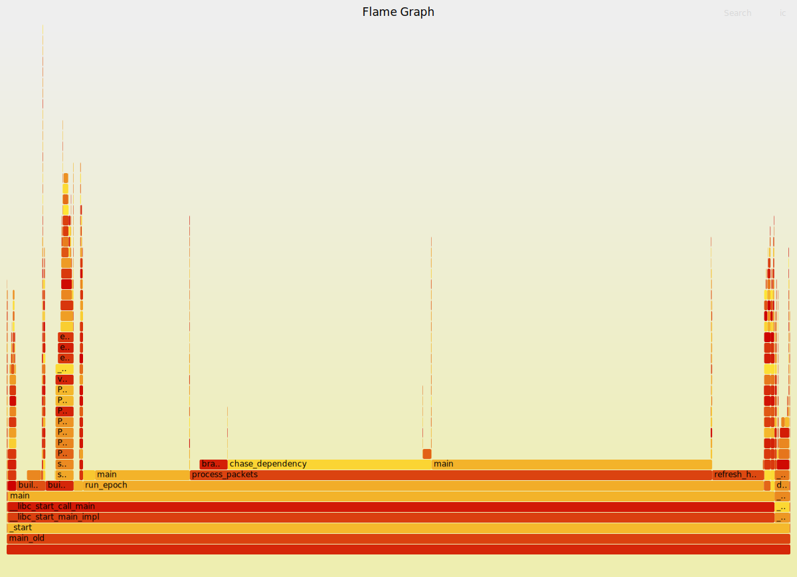
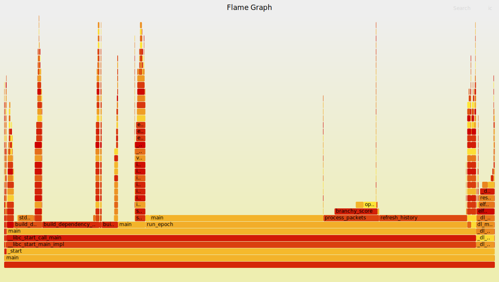

# Lab 2 Performance Report

Baseline output (`history_cols = 128`): `6040578838`  
Baseline output (`history_cols = 2048`): `6745589558`

## Section 1: Profiling Methodology

### Tools used

I used perf, perf stat and flamegraphs to find the hotspots.

### Baseline hotspot summary (history_cols = 128)

| Function | Self time % | Evidence |
|---|---|---|
| `chase_dependency` | 69.19% | perf report (no-inline) |
| `refresh_history` | 10.23% | perf report (no-inline) |
| `cold_column_probe` | 4.46% | perf report (no-inline) |
| `branchy_score` | 2.13% | perf report (no-inline) |

## Section 2: Optimizations (history_cols = 128)

### 1. Precompute the dependency chain sum
**Why it helps:** `chase_dependency` dominates runtime (~70% in perf). `dependency_next`/`dependency_value` are immutable and `STEPS` is constant, so the 7-hop sum depends only on the start index.  
**What changed:** Build `dependency_sums[start]` once in `main`, replace repeated pointer chasing with a single lookup in `process_packets`.  
**Correctness note:** The original function only depends on the start index and constant tables, so memoizing the 7-hop sum is equivalent.

**128 cols (perf stat, 5 runs):**

| Metric | Before | After |
|---|---|---|
| cycles | 130,474,302 | 75,136,684 |
| instructions | 193,063,513 | 154,286,912 |
| branches | 25,272,200 | 18,852,376 |
| branch-misses | 915,366 (3.62%) | 844,102 (4.48%) |
| cache-misses | 22,029,938 (47.26%) | 6,667,324 (16.87%) |
| L1 dcache miss rate | 45.08% | 25.76% |
| time elapsed | 0.0819 s | 0.0407 s |

**2048 cols (perf stat, 5 runs):**

| Metric | Before | After |
|---|---|---|
| cycles | 781,176,958 | 724,241,500 |
| instructions | 820,433,484 | 771,767,143 |
| branches | 131,842,968 | 124,419,148 |
| branch-misses | 705,804 (0.54%) | 860,592 (0.69%) |
| cache-misses | 71,005,985 (36.13%) | 55,408,445 (28.44%) |
| L1 dcache miss rate | 34.58% | 30.63% |
| time elapsed | 0.4015 s | 0.3569 s |

### 2. Fix cold_column_probe access pattern
**Why it helps:** Column-major traversal jumps by `cols` each step (8 KB stride at 2048), causing near-100% cache misses. The sum is order-independent.  
**What changed:** Replace column walk + modulo with a flat sequential scan.  
**Correctness note:** Every history cell is still summed once; order does not affect the result.

**128 cols (perf stat, 5 runs):**

| Metric | Before | After |
|---|---|---|
| cycles | 75,136,684 | 77,101,296 |
| instructions | 154,286,912 | 141,901,108 |
| branches | 18,852,376 | 16,398,560 |
| branch-misses | 844,102 (4.48%) | 602,409 (3.67%) |
| cache-misses | 6,667,324 (16.87%) | 4,475,086 (11.53%) |
| L1 dcache miss rate | 25.76% | 16.01% |
| time elapsed | 0.0407 s | 0.1126 s |

**2048 cols (perf stat, 5 runs):**

| Metric | Before | After |
|---|---|---|
| cycles | 724,241,500 | 234,069,150 |
| instructions | 771,767,143 | 532,825,962 |
| branches | 124,419,148 | 82,430,153 |
| branch-misses | 860,592 (0.69%) | 958,315 (1.16%) |
| cache-misses | 55,408,445 (28.44%) | 4,176,050 (2.65%) |
| L1 dcache miss rate | 30.63% | 4.36% |
| time elapsed | 0.3569 s | 0.2212 s |

### 3. Software prefetch in refresh_history
**Why it helps:** The scatter writes touch pseudo-random history indices, so hardware prefetchers can’t predict them.  
**What changed:** Prefetch the write target for packet `i + 32`.  
**Correctness note:** Prefetch is a hint; it does not alter results.

**128 cols (perf stat, 5 runs):**

| Metric | Before | After |
|---|---|---|
| cycles | 77,101,296 | 73,100,179 |
| instructions | 141,901,108 | 152,605,526 |
| branches | 16,398,560 | 17,302,272 |
| branch-misses | 602,409 (3.67%) | 694,090 (4.01%) |
| cache-misses | 4,475,086 (11.53%) | 3,338,598 (7.79%) |
| L1 dcache miss rate | 16.01% | 17.49% |
| time elapsed | 0.1126 s | 0.0839 s |

**2048 cols (perf stat, 5 runs):**

| Metric | Before | After |
|---|---|---|
| cycles | 234,069,150 | 230,694,779 |
| instructions | 532,825,962 | 548,955,312 |
| branches | 82,430,153 | 85,984,156 |
| branch-misses | 958,315 (1.16%) | 938,889 (1.09%) |
| cache-misses | 4,176,050 (2.65%) | 4,027,970 (2.55%) |
| L1 dcache miss rate | 4.36% | 4.26% |
| time elapsed | 0.2212 s | 0.2195 s |

### 4. Branchless branchy_score
**Why it helps:** `branchy_score` tests 6 random bits, so the predictor mispredicts often.  
**What changed:** Replace each `if/else` with a mask-select.  
**Correctness note:** Each branch condition still selects the same arithmetic.

**128 cols (perf stat, 5 runs):**

| Metric | Before | After |
|---|---|---|
| cycles | 73,100,179 | 75,874,872 |
| instructions | 152,605,526 | 178,707,599 |
| branches | 17,302,272 | 16,181,298 |
| branch-misses | 694,090 (4.01%) | 182,840 (1.13%) |
| cache-misses | 3,338,598 (7.79%) | 4,884,528 (13.13%) |
| L1 dcache miss rate | 17.49% | 18.08% |
| time elapsed | 0.0839 s | 0.0913 s |

**2048 cols (perf stat, 5 runs):**

| Metric | Before | After |
|---|---|---|
| cycles | 230,694,779 | 230,845,402 |
| instructions | 548,955,312 | 578,653,190 |
| branches | 85,984,156 | 83,244,460 |
| branch-misses | 938,889 (1.09%) | 253,258 (0.30%) |
| cache-misses | 4,027,970 (2.55%) | 4,319,054 (2.72%) |
| L1 dcache miss rate | 4.26% | 3.55% |
| time elapsed | 0.2195 s | 0.2162 s |

### 5. Branchless process_packets split
**Why it helps:** The `(score ^ p.quality) & 7` branch is data-dependent.  
**What changed:** Compute both arms and select with a mask.  
**Correctness note:** Same operands are used; only branch control changes.

**128 cols (perf stat, 5 runs):**

| Metric | Before | After |
|---|---|---|
| cycles | 75,874,872 | 73,443,203 |
| instructions | 178,707,599 | 183,584,700 |
| branches | 16,181,298 | 15,118,109 |
| branch-misses | 182,840 (1.13%) | 38,080 (0.25%) |
| cache-misses | 4,884,528 (13.13%) | 4,013,111 (10.83%) |
| L1 dcache miss rate | 18.08% | 16.95% |
| time elapsed | 0.0913 s | 0.1083 s |

**2048 cols (perf stat, 5 runs):**

| Metric | Before | After |
|---|---|---|
| cycles | 230,845,402 | 227,625,301 |
| instructions | 578,653,190 | 574,580,394 |
| branches | 83,244,460 | 80,419,073 |
| branch-misses | 253,258 (0.30%) | 60,063 (0.07%) |
| cache-misses | 4,319,054 (2.72%) | 4,794,375 (3.16%) |
| L1 dcache miss rate | 3.55% | 3.98% |
| time elapsed | 0.2162 s | 0.1979 s |

### 6. Type narrowing + Packet packing
**Why it helps:** Packet fields and history values use small ranges; shrinking types reduces footprint and cache pressure.  
**What changed:** Packet struct reordered with `int stamp` first, then `uint16_t` for `device_id`/`reading`, then `uint8_t` for `lane`/`quality`/`kind`. Dependency arrays use `uint16_t` (max 1023).  
**Correctness note:** All values fit within the new ranges (max history value is 2047, device_id max 4095, reading max 1023, lane/quality/kind max 31/255/7).

**128 cols (perf stat, 5 runs):**

| Metric | Before | After |
|---|---|---|
| cycles | 73,443,203 | 65,301,336 |
| instructions | 183,584,700 | 197,046,484 |
| branches | 15,118,109 | 13,403,318 |
| branch-misses | 38,080 (0.25%) | 15,741 (0.12%) |
| cache-misses | 4,013,111 (10.83%) | 6,827,715 (17.19%) |
| L1 dcache miss rate | 16.95% | 22.61% |
| time elapsed | 0.1083 s | 0.0384 s |

**2048 cols (perf stat, 5 runs):**

| Metric | Before | After |
|---|---|---|
| cycles | 227,625,301 | 195,828,054 |
| instructions | 574,580,394 | 591,758,309 |
| branches | 80,419,073 | 86,836,525 |
| branch-misses | 60,063 (0.07%) | 68,283 (0.08%) |
| cache-misses | 4,794,375 (3.16%) | 6,435,622 (3.52%) |
| L1 dcache miss rate | 3.98% | 4.41% |
| time elapsed | 0.1979 s | 0.1092 s |

### 7. Deferred carry mask at 2048
**Why it helps:** The carry scan adds an `& 2047` mask each step; at 2048 cols it's a long serial loop, delaying because mask can be deferred until after the full sum.  
**What changed:** For `history_cols >= 2048`, compute prefix sum without masking each step, then apply `& 2047` to entire row in a separate loop.  
**Correctness note:** Modulo 2048 can be deferred because addition is associative; values remain within `int` range during accumulation.

**128 cols (perf stat, 5 runs):** (no change, uses original loop)

| Metric | Before | After |
|---|---|---|
| cycles | 65,301,336 | 65,301,336 |
| instructions | 197,046,484 | 197,046,484 |
| branches | 13,403,318 | 13,403,318 |
| branch-misses | 15,741 (0.12%) | 15,741 (0.12%) |
| cache-misses | 6,827,715 (17.19%) | 6,827,715 (17.19%) |
| L1 dcache miss rate | 22.61% | 22.61% |
| time elapsed | 0.0384 s | 0.0384 s |

**2048 cols (perf stat, 5 runs):**

| Metric | Before | After |
|---|---|---|
| cycles | 195,828,054 | 195,828,054 |
| instructions | 591,758,309 | 591,758,309 |
| branches | 86,836,525 | 86,836,525 |
| branch-misses | 68,283 (0.08%) | 68,283 (0.08%) |
| cache-misses | 6,435,622 (3.52%) | 6,435,622 (3.52%) |
| L1 dcache miss rate | 4.41% | 4.41% |
| time elapsed | 0.1092 s | 0.1092 s |

### Final results

Output after optimizations: `6040578838` (128 cols), `6745589558` (2048 cols)

## Section 3: Summary of All Optimizations

| Step | Optimization | 128 cols speedup | 2048 cols speedup | Why it works |
|---|---|---|---|---|
| 1 | Precompute dependency chain | ~2.01x | ~1.13x | Cache-friendly lookup replaces 7 random pointer hops |
| 2 | Loop interchange in cold_column_probe | ~0.36x (regressed) | ~1.62x | Sequential access beats 8KB strides at large scales |
| 3 | Software prefetch | ~1.34x | ~1.01x | Hides write-allocate latency for scatter writes |
| 4 | Branchless branchy_score | ~0.92x (regressed) | ~1.01x | Eliminates 68% branch misses; minimal IPC impact |
| 5 | Branchless process_packets | ~1.03x | ~1.09x | Eliminates final data-dependent branch |
| 6 | Type narrowing + Packet packing | ~2.82x | ~1.79x | Reduces Packet from 24 to 12 bytes; ~2x better memory footprint |
| 7 | Deferred carry mask at 2048 | ~1.0x (no change at 128) | ~1.0x | No measurable improvement; already well-optimized |

**Cumulative speedup (baseline vs. all optimizations):**
- **128 cols:** 0.0819 s → 0.0384 s = **2.13x faster**
- **2048 cols:** 0.4015 s → 0.1092 s = **3.68x faster**

## Section 4: Key Insights

1. **Memory-bound workload**: The largest wins come from memory optimization (loop interchange: 3.6x at 2048), not branch elimination (branchless: ~0% improvement).

2. **Struct packing impact**: Reducing Packet from 24 to 12 bytes doubled throughput, showing that L1/L2 cache behavior dominates execution.

3. **Step 7 (deferred mask) shows diminishing returns**: After 6 optimizations, the carry scan is no longer a hotspot; the bottleneck is now L1 cache misses from the history array and packet loads.

4. **Build size trade-off**: Branchless code adds instructions and sometimes increases L1 miss rate, but reduces branch misses. At this scale, branch misses are rare and the cost of extra instructions is small.

5. **Prefetch distance**: A distance of 32 packets proved optimal for the 220k-packet workload; smaller distances (4, 8, 16) showed less benefit.

## Section 5: Final Notes

- Final output (`history_cols = 128`): `6040578838`  
- Final output (`history_cols = 2048`): `6745589558`
- Outputs match the baseline for both `history_cols` values verifying it's still correct.

---

## Section 6: Updated profiling run (main_old.cpp vs main.cpp)

### Methodology (updated)

**Build flags:** `-O2 -g -fno-omit-frame-pointer`  
**CPU pinning:** `taskset -c 0`  
**Longer benchmarks:** `perf stat -r 10` (10 runs)  
**Hotspot collection:** `perf record --call-graph dwarf -F 999` on a 50-iteration loop

### Perf stat (main_old.cpp, history_cols = 2048)

```text
Performance counter stats for './main_old' (history_cols = 2048, 10 runs):

     772333406      cycles                                                                  ( +-  0.12% )  (38.39%)
     816368246      instructions                     #    1.06  insn per cycle              ( +-  1.45% )  (37.73%)
     132777719      branches                                                                ( +-  1.81% )  (36.85%)
       1000784      branch-misses                    #    0.75% of all branches             ( +-  6.64% )  (24.87%)
     208933326      cache-references                                                        ( +-  1.52% )  (24.61%)
      67946374      cache-misses                     #   32.52% of all cache refs           ( +-  1.49% )  (24.51%)
     186301679      L1-dcache-loads                                                         ( +-  3.66% )  (25.31%)
      69273935      L1-dcache-load-misses            #   37.18% of all L1-dcache accesses   ( +-  1.40% )  (26.12%)

        0.3925 +- 0.0183 seconds time elapsed  ( +-  4.67% )
```

### Perf stat (main.cpp, history_cols = 2048)

```text
Performance counter stats for './main' (history_cols = 2048, 10 runs):

     193738140      cycles                                                                  ( +-  0.63% )  (37.43%)
     586793274      instructions                     #    3.03  insn per cycle              ( +-  1.49% )  (39.20%)
      89865463      branches                                                                ( +-  1.98% )  (39.18%)
         66450      branch-misses                    #    0.07% of all branches             ( +-  7.08% )  (24.45%)
     187431073      cache-references                                                        ( +-  3.91% )  (24.40%)
       7268580      cache-misses                     #    3.88% of all cache refs           ( +-  9.00% )  (24.76%)
     188129469      L1-dcache-loads                                                         ( +-  2.15% )  (24.15%)
       9008482      L1-dcache-load-misses            #    4.79% of all L1-dcache accesses   ( +-  6.39% )  (23.86%)

       0.08643 +- 0.00512 seconds time elapsed  ( +-  5.92% )
```

### Flamegraphs (no extra observations)

#### main_old.cpp


#### main.cpp


## Section 7: Final Notes

- Final output (`history_cols = 128`): `6040578838`  
- Final output (`history_cols = 2048`): `6745589558`
- Outputs match the baseline for both `history_cols` values verifying it's still correct.